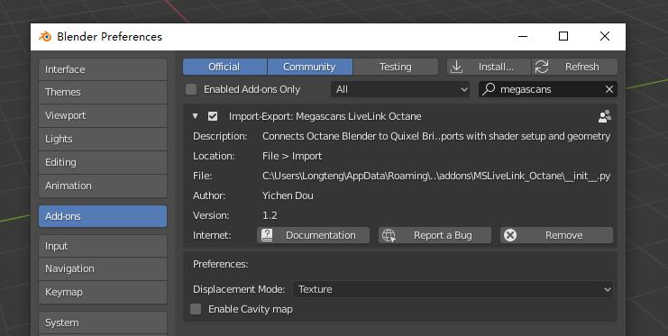

# MSLiveLink-OC-Blender
Quixel Megascans Plugin for Octane Blender Edition

## Versions

> Windows

[Quixel Official Documentation](https://help.quixel.com/hc/en-us/articles/360002425298-Installing-the-Megascans-Plugin-for-Blender-2-8)

MSLiveLink Octane version 1.1.0

Official base addon version 1.2

OctaneRender™ for Blender 2019.1.4 - 20.6 [TEST] and later

## Installation

1. Download this repository as a zip

2. Extract the MSLiveLink_Octane folder (not the MSLiveLink-OC-Blender-master)

3. Copy it into BlenderOctane addon's folder

   > ..\BlenderOctane\2.81\scripts\addons **OR**
   >
   > C:\Users\\[Username]\AppData\Roaming\Blender Foundation\Blender\2.81\scripts\addons

4. Activate it in Blender addons
5. Switch to Octane Render engine
6. File > Import > Megascans LiveLink Octane will activate a socket client listening to the Megascans Bridge
7. Open the Megascans Bridge and change the export method to Blender
8. Click export. Feel fun

## Upgrading

1. Remove the addon and relaunch the OC Blender 
2. Download this repository as a zip
3. Follow instructions to install the addon

Otherwise, socket running in the thread will cause a problem

## Features
> Specular map option in Megascans Bridge is suggested to be turned on before you download the asset
> Bump and Cavity maps are optional and not recommanded to use directly
> If you see some chunks on the texture, it's probally caused by the Bump map

| Title        | Status        |
| ------------ | ------------- |
| Albedo       | Supported     |
| Displacement | Supported     |
| Normal       | Supported     |
| Roughness    | Supported     |
| Specular     | Supported     |
| Opacity      | Supported     |
| Translucency | Supported     |
| Metalness    | Supported     |
| Bump         | Supported     |
| Fuzz         | Supported     |
| Cavity       | Supported     |
| AO           | Not Supported |
| Gloss        | Not Supported |
| Normal Bump  | Not Supported |

